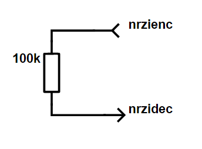
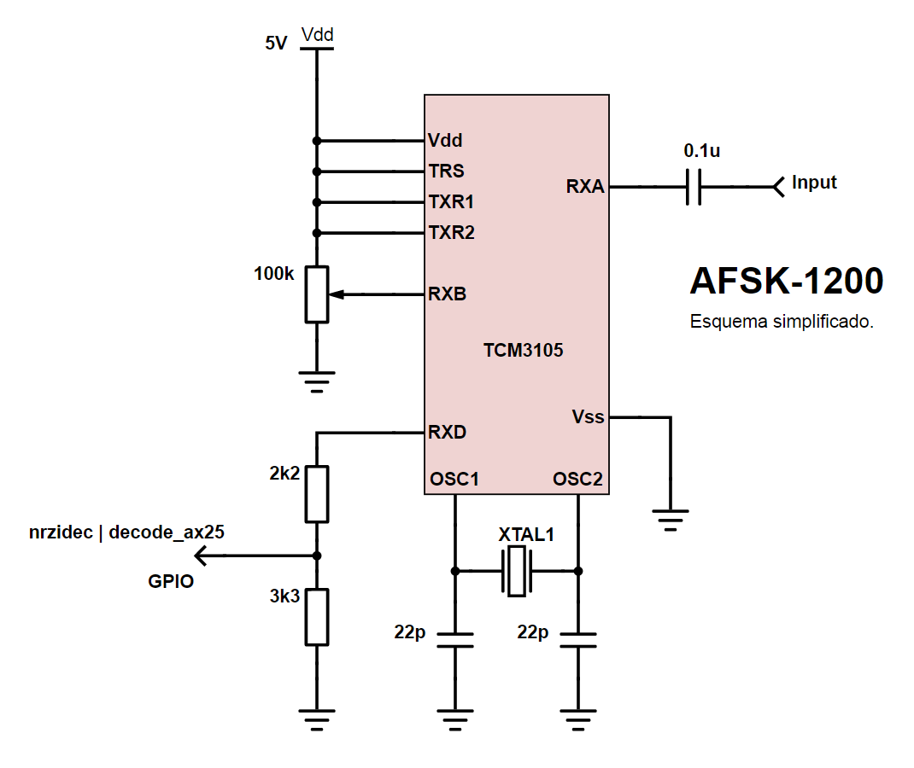

afsk-ax25
=========

Support files for a post about decoding FSK from scratch.

http://electronicayciencia.blogspot.com/2017/10/demodular-afsk-desde-cero.html (spanish)

Files
-----

- [nrzidec.c](nrzidec.c): Read a GPIO pin and writes 1's and 0's into stdout following a NRZI line code.

- [nrzienc.c](nrzienc.c]): Read 1's and 0's from stdin and toggles a GPIO pin following NRZI line code. Useful to test nrzidec.

- [decode_ax25.c](decode_ax25.c): Read 1's and 0's from stdin and tries to decode then as a AX25 packet.

- [test_data](test_data): Directory with some raw binary AX25 packets to test decode_ax25.

- [test_snd](test_snd): Directory with some synthetic and real recorded frames.

- [misc](misc): Auxiliary files.

Build
-----

You will need a Raspberry and WiringPi library to compile nrzienc and nrzidec.
Copy files to Rapsberry and run 

	make

Test
----

To test nrzienc and nrzidec you can connect GPIO 24 and 25 (or wathever GPIO pins you choose) using a resistor like this:

Then run `./nrzidec` in one terminal and `sudo ./nrzienc` in another one. 
nrzienc file requires sudo to ensure proper timing. 
You should see the same pattern in both of them.

To test only AX25 decoder file, just feed it with one of the sample packages in test_data.

	./decode_ax25 < test_data/UI.dat

Usage
-----

In one terminal:

	./nrzidec | ./decode_ax25

In another terminal, for testing you can do:

	./nrzienc < test_data/UI.dat

The intention is to use a hardware modem, like one based on TCM3105.
You can use this simple schematic to begin with:

When you have one, just use ./nrzidec to proccess its output and feed it to decode_ax25.

	./nrzidec | ./decode_ax25

